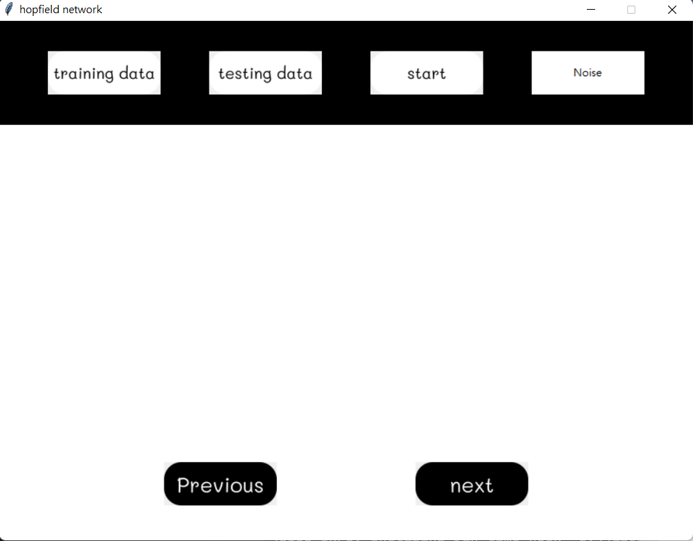
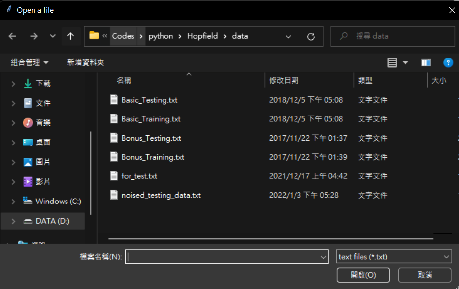
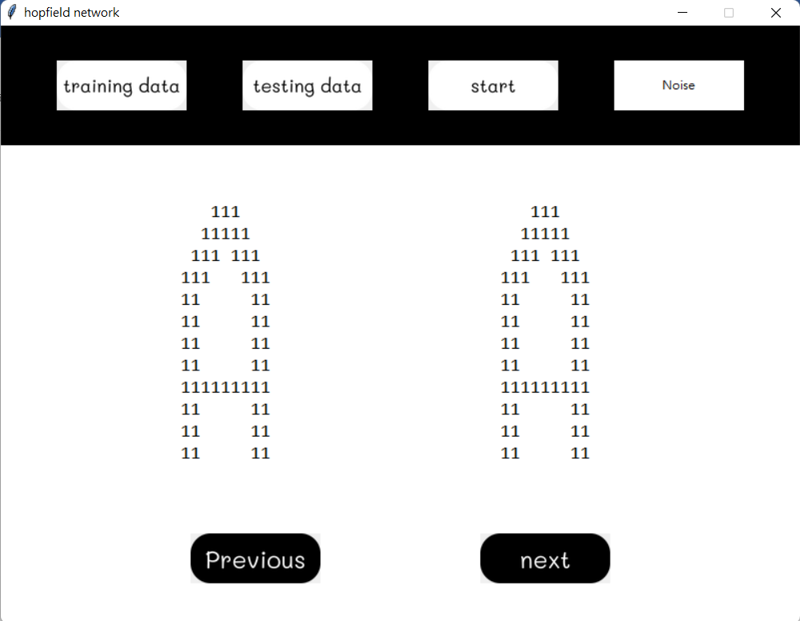
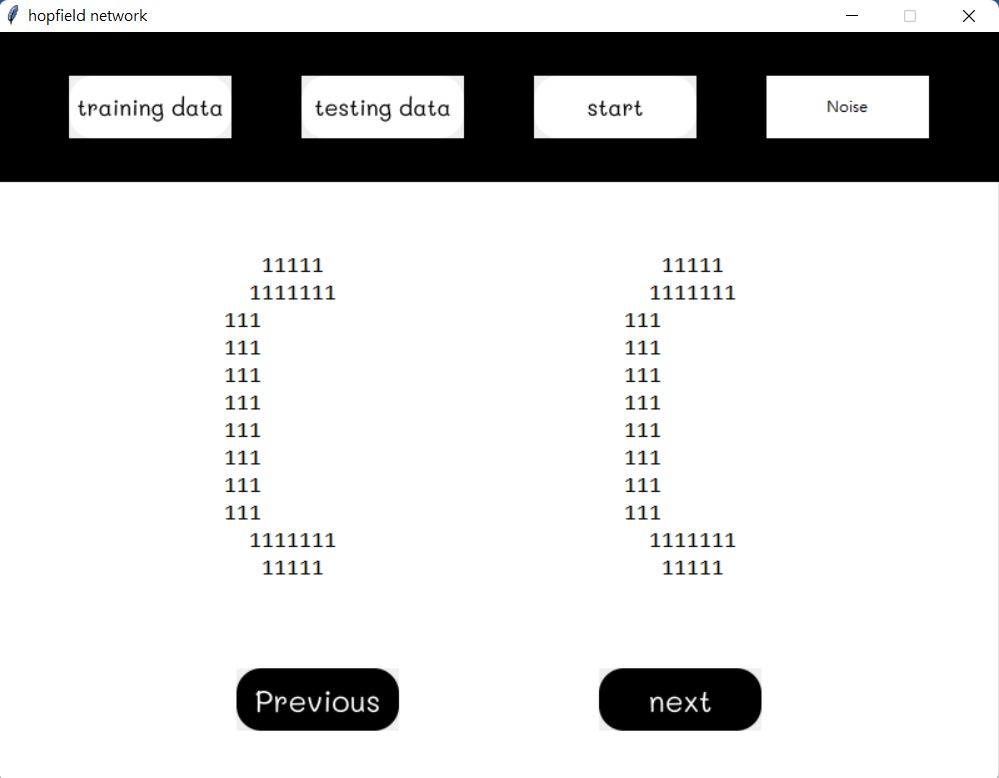

# 使用說明
### 開啟gui.exe，下圖為開啟後畫面

### 按下training data按鈕可以選擇要用的training data，預設會開啟./data資料夾

### 按下testing data按鈕可以選擇要用的testing data
### 按下start後，可在下方看到回想結果

### 左方顯示的是應該要回想出的圖形，右方則是網路回想的結果
### 按下previous、next 可以看前一個或下一個回想結果

### 加入雜訊
如果想要將訓練資料集加入雜訊，可以先按下testing data按鈕選取一個testing data，選完testing data後按下noise按鈕會在./data資料夾中生成noised_testing_data.txt，之後就可以用這個檔案當作testing data囉!

# 程式簡介
有gui.py和model.py兩個.py檔，以下為相關介紹
- Gui.py: GUI相關程式碼 
  - add_noise: 生成有噪音的測試資料
- Model.py:
 	- load_data: 讀取.txt後回傳一個ndarray，提供網路做預測
 	- get_model: 根據training data生成模型(包含權重和theta，但後來theta並沒有使用)並回傳
 	- predict: 給一筆training data，輸入模型後回傳預測結果(採用非同步的更新)